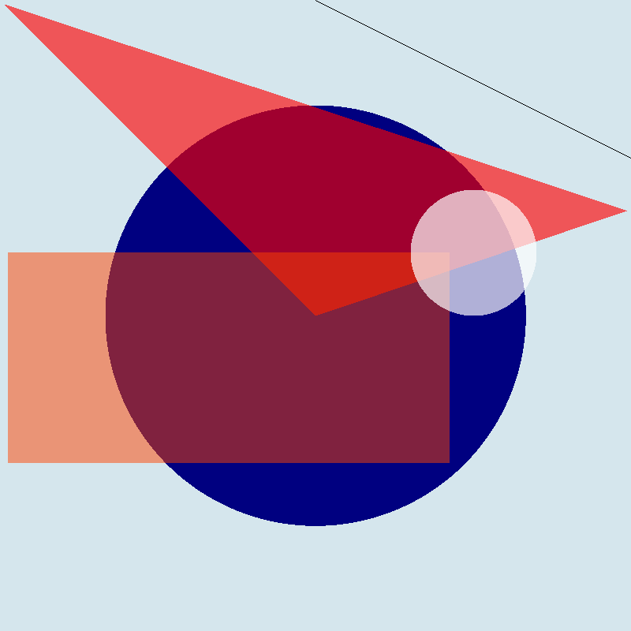

# A simple (cimple) library for drawing (painting) in ppm image files using C programming language.

An objective for this library is to make simple drawings in C. Currently the output is a ppm file, this 
can be easily converted to png using ```ffmpeg``` via ```ffmpeg -i input.ppm output.png```. In the future 
I am planning to draw to a Xlib window or directly to a png file. 

I'm doing this to learn how to do simple graphics and for playing with Xlib
and image file formats.

In the longer run I see this library rendering stl files in a Xlib window, as previously said, all of this
with minimal requirements, only C programming language and -almost- no other third party libraries.

## Sample output of drawing primitives, now with alpha channel supported!!


 
	
	
	
